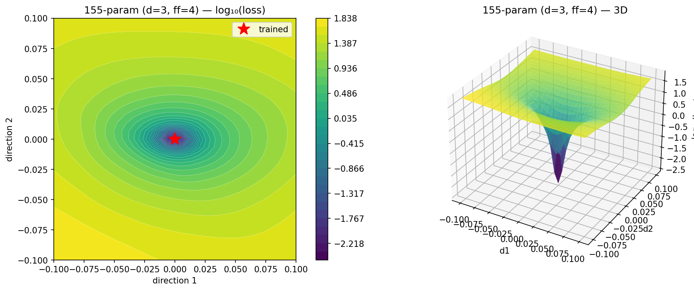
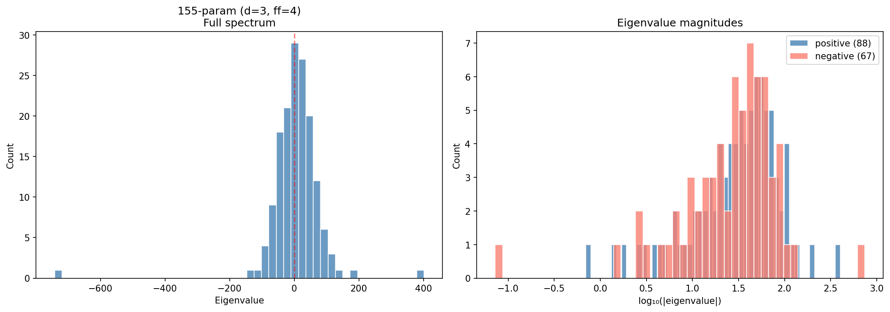

# minimal-ten-digit-addition-transformer

A **155-parameter** Qwen3 transformer that does 10-digit addition at **99.92% accuracy** on the [AdderBoard](https://github.com/anadim/AdderBoard) 10K test suite. Trained with plain AdamW, no tricks, no curriculum learning, no grokking.

## The only insight: use a tiny RoPE theta

RoPE with `head_dim=4` gives two frequencies: `1/θ^(0/4) = 1.0` and `1/θ^(2/4)=1/sqrt(θ)`. The full sequence is 35 tokens (24 input + 11 output). At θ=10000.0 the slow frequency is `1/100 = 0.01` so over 35 tokens it rotates `0.01 × 34 ≈ 0.34 rad`, so positions are nearly indistinguishable. At θ=3 it's `1/√3 ≈ 0.577`, rotating `0.577 × 34 ≈ 19.6 rad`, every position gets a unique, well-separated signature.

The choice of RoPE θ alone makes or breaks the training at this model param scale.

## Architecture

| Model | Params | Accuracy | d | ff | lr |
|---|---|---|---|---|---|
| **155-param** | 155 | 99.92% | 3 | 4 | 0.01 |
| 173-param | 173 | 99.93% | 3 | 6 | 0.01 |
| 200-param | 200 | 99.99% | 3 | 9 | 0.01 |
| 228-param | 228 | 100% | 4 | 6 | 3e-3 |

All are 1-layer Qwen3 with `2h/1kv, hd=4, vocab=10, rope_theta=3`, tied embeddings.

## Training

### 155-param model (current best)

```bash
python train.py
```

Trains for 45k steps with AdamW (lr=0.01), batch size 128. Reaches 99.92% accuracy (8 failures out of 10,010).

```
$ python verify.py submission.py

Results: 10002/10010 correct (99.92%)
Time: 36.7s (273 additions/sec)
Status: QUALIFIED (threshold: 99%)
```

## Inference

```python
from submission import build_model, add

model, metadata = build_model()
result = add(model, 1234567890, 9876543210)
print(result)  # 11111111100
```

## How it works

Two integers (up to 10 digits each) are encoded digit-by-digit in **least-significant-digit-first** order, separated by zero tokens. The model autoregressively predicts the 11-digit sum in the same reversed format.

```
Input:  [0] d0 d1 ... d9 [0] [0] d0 d1 ... d9 [0]
Output: s0 s1 ... s10  (LSD-first)
```

## Analysis: why AdamW plateaus

The 155-param model gets stuck at 99.92%, 8 failures that never go away no matter how long you train. Hessian eigenvalues show: AdamW converges to a saddle point where 67 out of 155 eigenvalues are negative i.e there are directions where loss decreases but a first-order optimizer can't find them.





For example L-BFGS (or any other second-order optimizer) escapes the saddle point and gets to 100%:

| Model | AdamW | + L-BFGS |
|---|---|---|
| 155-param | 99.92% | 100% |
| 173-param | 99.93% | 100% |
| 200-param | 99.99% | 100% |
| 228-param | 100% | -|

228-param is the only one with enough capacity for AdamW to find a true minimum on its own.
> **Note:** LR scheduling could help refine last updates, haven't tried that!

```bash
python finetune.py           # finetune current model (155-param)
python finetune.py --ff 6    # finetune the 173-param model
```

## Citation

```bibtex
@misc{taghadouini2025tinyrope,
  author       = {Said Taghadouini},
  title        = {minimal-ten-digit-addition-transformer},
  year         = {2026},
  url          = {https://github.com/staghado/minimal-ten-digit-addition-transformer}
}
```
