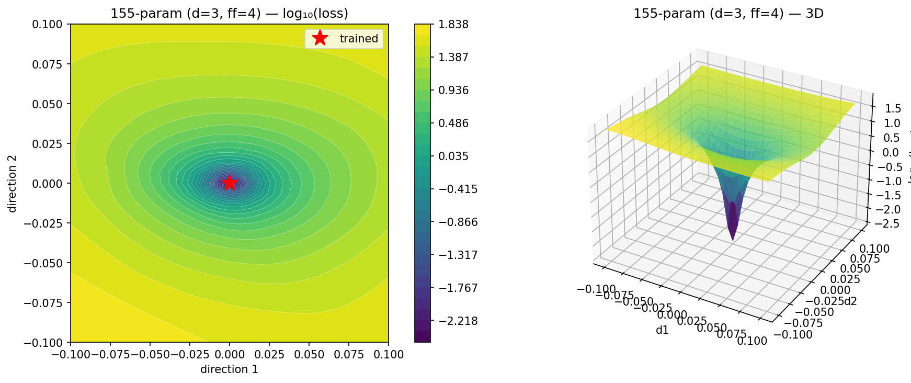
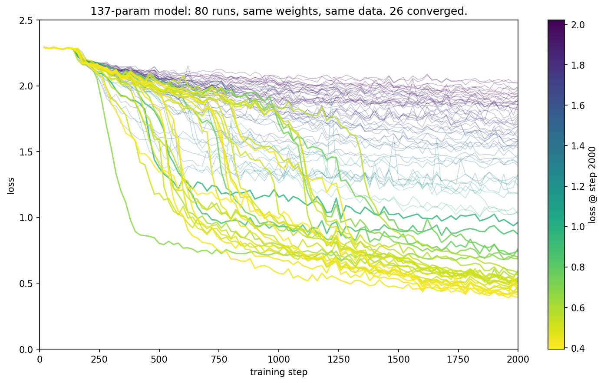
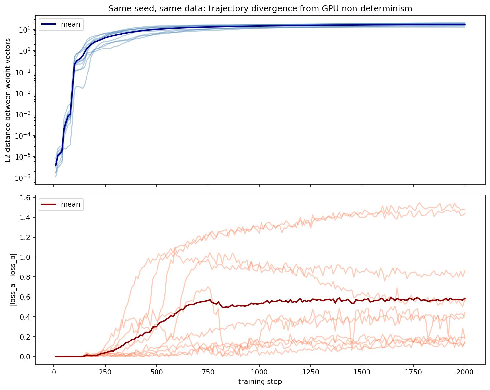

# minimal-ten-digit-addition-transformer

A **146-parameter** Qwen3 transformer that does 10-digit addition at **99.98% accuracy** on the [AdderBoard](https://github.com/anadim/AdderBoard) 10K test suite. Trained with plain AdamW, no tricks, no curriculum learning, no grokking.

## The only insight: use a tiny RoPE theta

RoPE with $d_h=4$ gives two frequencies: $1/\theta^{0/4} = 1.0$ and $1/\theta^{2/4} = 1/\sqrt{\theta}$. The full sequence is 35 tokens (24 input + 11 output). At $\theta = 10000$ the slow frequency is $1/100 = 0.01$, so over 35 tokens it rotates $0.01 \times 34 \approx 0.34$ rad and positions are nearly indistinguishable. At $\theta = 3$ it's $1/\sqrt{3} \approx 0.577$, rotating $0.577 \times 34 \approx 19.6$ rad, every position gets a unique, well-separated signature.

The choice of $\theta$ alone makes or breaks training at this scale.

## Architecture

| Model | Params | Accuracy | d | ff | lr |
|---|---|---|---|---|---|
| 137-param | 137 | 99.73% | 3 | 2 | 0.01 |
| **146-param** | 146 | 99.98% | 3 | 3 | 5e-3 |
| 155-param | 155 | 99.92% | 3 | 4 | 0.01 |
| 173-param | 173 | 99.93% | 3 | 6 | 0.01 |
| 200-param | 200 | 99.99% | 3 | 9 | 0.01 |
| 228-param | 228 | 100% | 4 | 6 | 3e-3 |

All are 1-layer Qwen3 with `2h/1kv, hd=4, vocab=10, rope_theta=3`, tied embeddings.

## Training

### 146-param model (current best)

```bash
python train.py
```

Trains for 45k steps with AdamW (lr=0.005), batch size 128. Reaches 99.98% accuracy (2 failures out of 10,010).

```
$ python verify.py submission.py

Results: 10008/10010 correct (99.98%)
Time: 36.8s (272 additions/sec)
Status: QUALIFIED (threshold: 99%)
```

## Inference

```python
from submission import build_model, add

model, metadata = build_model()
result = add(model, 1234567890, 9876543210)
print(result)  # 11111111100
```

## How it works

Two integers (up to 10 digits each) are encoded digit-by-digit in **least-significant-digit-first** order, separated by zero tokens. The model autoregressively predicts the 11-digit sum in the same reversed format.

```
Input:  [0] d0 d1 ... d9 [0] [0] d0 d1 ... d9 [0]
Output: s0 s1 ... s10  (LSD-first)
```

## Analysis: why AdamW plateaus

AdamW plateaus just short of 100% at every model size below 228 params. Hessian eigenvalues show why: AdamW converges to a saddle point (e.g. 67/155 negative eigenvalues for the 155-param model), there are directions where loss decreases but a first-order optimizer can't find them.



For example L-BFGS (or any other second-order optimizer) escapes the saddle point and gets to 100%:

| Model | AdamW | + L-BFGS |
|---|---|---|
| 137-param | 99.73% | 100% |
| 146-param | 99.98% | 100% |
| 155-param | 99.92% | 100% |
| 173-param | 99.93% | 100% |
| 200-param | 99.99% | 100% |
| 228-param | 100% | - |

228-param is the only one with enough capacity for AdamW to find a true minimum on its own.
> **Note:** LR scheduling could help refine last updates, haven't tried that!

### Chaotic training dynamics at 137 params

At 137 params the training trajectory becomes chaotic. Running 80 identical experiments (same weights, same data, same seed) produces different outcomes due to non-deterministic GPU floating point reductions. Only ~30% of runs converge.



Tracking weight divergence between paired identical runs confirms exponential separation: perturbations of $10^{-6}$ grow by 7 orders of magnitude in ~500 steps, a positive Lyapunov exponent. By step 500 the trajectories are in entirely different regions of parameter space.



```bash
python finetune.py           # finetune current model (146-param)
python finetune.py --ff 4    # finetune the 155-param model
```

## Citation

```bibtex
@misc{taghadouini2025tinyrope,
  author       = {Said Taghadouini},
  title        = {minimal-ten-digit-addition-transformer},
  year         = {2026},
  url          = {https://github.com/staghado/minimal-ten-digit-addition-transformer}
}
```
